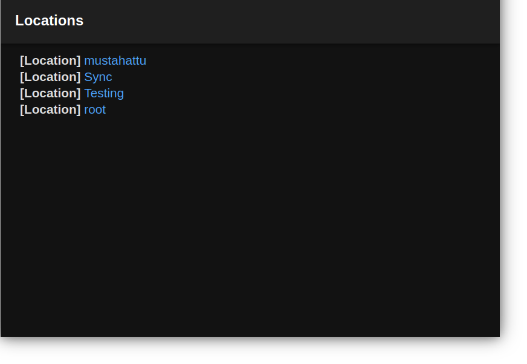
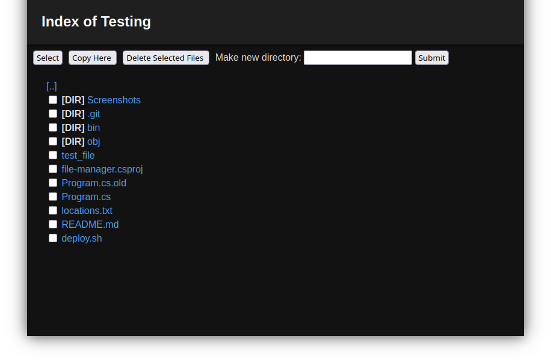

## How to Run
`git clone` and run `dotnet run`
## Locations File
This file manager works by reading locations from a file witch are aliases to locations in the file system that will be served at the top level of the web client

locations.txt   
```
root = /
foo = /foo/bar/
```
The "root" can be accessed on `localhost/root` and will serve files from the disk at `/`
and the "foo" location can be viewed on `localhost/foo` and gives files that are at `/foo/bar/`

**Every location has to end with a '/' !!!**

## How to use
To go between files just click the links. 

To Delete click the checkboxes next to the files, click the `Select` button and then click the `Delete files` button

To Delete click the checkboxes next to the files, click the `Select`, then move to the desired location and press `Copy Here` button

To create a directory write the directory name in the box and click `Enter` or `Submit`

## Screenshots



